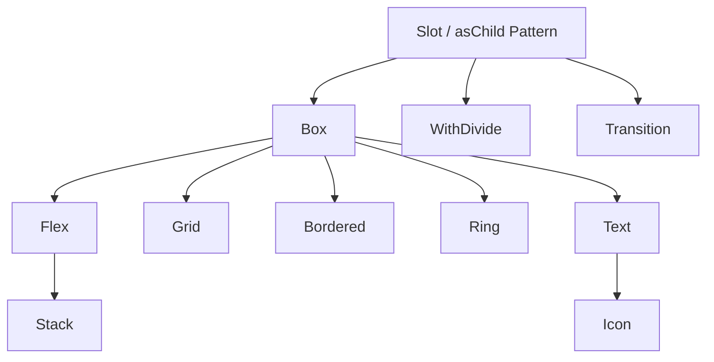

# LifeForge Frontend UI Library Architecture & Usage Guide

Welcome to the **LifeForge UI Library Guide**. This document serves as the single source of truth for frontend development in the LifeForge ecosystem. Anyone writing frontend code for LifeForge must read this guide from cover to cover before writing a single line of code.

---

## 1. Core Philosophy & Architectural Overview

The LifeForge UI library is built on a **zero-runtime CSS-in-JS** architecture powered by **[Vanilla Extract](https://vanilla-extract.style/)** and **[Sprinkles](https://vanilla-extract.style/documentation/packages/sprinkles/)**. This provides total type safety, compile-time optimization, and rich theme integration without the performance overhead of traditional CSS-in-JS solutions.

### Two Strict Rules

> [!IMPORTANT]
> **RULE 1: NO TAILWINDCSS AT ALL**  
> Tailwind utility classes, `@apply` directives, `@reference`, `@layer`, and `theme()` are **forbidden** in all files - `.tsx`, `.css`, `.css.ts`, everywhere. All layout, spacing, typography, and styling must use the custom primitives or standard CSS custom properties. Third-party library overrides in `.css` files must use plain CSS with `var(--color-*)` custom properties - never `@apply`, `@layer`, or Tailwind classes. External library CSS should be imported with plain `@import` (no `layer()`).

> [!IMPORTANT]
> **RULE 2: NO INLINE STYLES FOR CORE LAYOUT & DESIGN**  
> Custom inline `style` objects must be avoided. If a style can be represented through component props or tokens, you **must** use those props. Inline styles are reserved solely for truly dynamic runtime calculations (e.g., coordinates from drag-and-drop events).

> [!IMPORTANT]
> **RULE 3: PRIMITIVES FIRST, INLINE STYLES AND CSS.TS LAST**  
> Every style must first be attempted using UI primitives (`Box`, `Flex`, `Stack`, `Grid`, `Text`, `Icon`, `Bordered`, `Ring`, `Button`, `Card`, etc.) and their props. Only when a style **cannot** be expressed through any primitive prop - even with `asChild` composition - should you resort to inline `style` or a `.css.ts` vanilla-extract file. Acceptable exceptions: `fontFamily` for custom fonts, `listStyleType` for list markers, `wordBreak` for table cells. If a `.css.ts` file is created, it must contain ONLY the styles that cannot be achieved through primitives - nothing more.

### Design Tokens & Dynamic Scaling

The design system defines global tokens under `vars` (compiled to CSS variables) that automatically scale with user personalisation settings:

- **Font Scale (`--custom-font-scale`):** Scales typography and padding/margin dynamically.
- **Border Radius Multiplier (`--custom-border-radius-multiplier`):** Auto-scales corners from sharp to pill-like.
- **Custom Themes (`.theme-[color]` & `.bg-[palette]`):** Sets theme shades for brand colors (`--color-custom-*`) and background palettes (`--color-bg-*` like slate, zinc, neutral, mauve, olive, mist, taupe).

---

## 2. Global Token Systems

All standard layout and typography options are referenced via type-safe tokens exported by the system.

### A. Spacing & Margin/Padding Tokens

Spacing scales are defined under `vars.space` and scale with font size to keep visual rhythm:

- `none`: `'0'`
- `xs`: `calc(var(--spacing) * 1)` (equivalent to `4px` base)
- `sm`: `calc(var(--spacing) * 2)` (`8px` base)
- `md`: `calc(var(--spacing) * 4)` (`16px` base)
- `lg`: `calc(var(--spacing) * 6)` (`24px` base)
- `xl`: `calc(var(--spacing) * 8)` (`32px` base)
- `2xl`: `calc(var(--spacing) * 12)` (`48px` base)
- `3xl`: `calc(var(--spacing) * 16)` (`64px` base)

### B. Border Radius (Rounding) Tokens

Border corners are defined under `vars.radii` and scale with the user's corner multiplier:

- `none`: `'0'`
- `sm`: `var(--radius-sm)`
- `md`: `var(--radius-md)`
- `lg`: `var(--radius-lg)`
- `xl`: `var(--radius-xl)`
- `2xl`: `var(--radius-2xl)`
- `3xl`: `var(--radius-3xl)`
- `full`: `'9999px'`

### C. Typography Scales

Typography values scale with `--custom-font-scale`:

| Size Token | Font Size (`fontSize`) | Line Height (`lineHeight`)      |
| :--------- | :--------------------- | :------------------------------ |
| `xs`       | `var(--text-xs)`       | `var(--text-xs--line-height)`   |
| `sm`       | `var(--text-sm)`       | `var(--text-sm--line-height)`   |
| `base`     | `var(--text-base)`     | `var(--text-base--line-height)` |
| `lg`       | `var(--text-lg)`       | `var(--text-lg--line-height)`   |
| `xl`       | `var(--text-xl)`       | `var(--text-xl--line-height)`   |
| `2xl`      | `var(--text-2xl)`      | `var(--text-2xl--line-height)`  |
| `3xl`      | `var(--text-3xl)`      | `var(--text-3xl--line-height)`  |
| `4xl`      | `var(--text-4xl)`      | `var(--text-4xl--line-height)`  |
| `5xl`      | `var(--text-5xl)`      | `1`                             |
| `6xl`      | `var(--text-6xl)`      | `1`                             |
| `7xl`      | `var(--text-7xl)`      | `1`                             |
| `8xl`      | `var(--text-8xl)`      | `1`                             |
| `9xl`      | `var(--text-9xl)`      | `1`                             |

**Font Weights:**

- `normal`: `'400'`
- `medium`: `'500'`
- `semibold`: `'600'`
- `bold`: `'700'`

### D. Category/Tag Chips

For dynamic category labels or tag chips that need background colors based on data (not theme tokens), use **inline `style` with `backgroundColor`** set directly from the data source. Do NOT create `.css.ts` files for one-off dynamic colors - inline styles are the correct pattern here because the color value is computed at runtime from external data.

✅ **Correct (dynamic colors from data):**

```tsx
<span
  style={{
    backgroundColor: category.color + '20',
    color: category.color
  }}
>
  {category.name}
</span>
```

> [!TIP]
> **Dynamic category colors are the exception to Rule 2.** If the background/color pair comes from database or API data (e.g. `bg-green-500/20 text-green-500`), use inline `style` with hex color + opacity. Do not create token mappings or CSS files for dynamic data-driven colors.

---

## 3. Style Resolution & The Styling Engine

LifeForge uses a custom styling resolver, `resolveStyles()`, which translates token-based properties and responsive objects into static class names and CSS custom properties at runtime.

### A. Color Properties & State Resolvers

Colors in LifeForge are resolved through an **arbitrary CSS variable architecture** that handles dynamic user personalization and interactions. The primary color properties are:

- `bg`: Background Color (`--lf-bg`)
- `color`: Text/Foreground Color (`--lf-color`)
- `borderColor`: Border Color (`--lf-border-color`)
- `ringColor`: Focus Ring Color (`--lf-ring-color`)
- `ringOffsetColor`: Offset Ring Color (`--lf-ring-offset-color`)
- `divideColor`: Dividing Line Color (`--lf-divide-color`)

#### Supported Color Keys

1. **Base Palette:** `transparent`, `dangerous` (`#ef4444`), `muted` (mid-gray), `primary` (user-accented), `inherit`, `custom-50` to `custom-900` (accent shades), and `bg-50` to `bg-950` (system background shades).
2. **Tailwind Palette Names:** Colors like `red-500`, `blue-600`, `emerald-400` map directly to tailwind shades.
3. **Color with Opacity:** Zero-runtime opacity can be added using the `colorWithOpacity(token, opacityValue)` utility.
4. **No `white` or `black` color tokens.** Use `bg-50` for white and `bg-950` for black. The `green-*`, `red-*`, `yellow-*`, and other Tailwind palette names are available for semantic colors (e.g. `red-500` for destructive states, `green-600` for success).

#### Theme & State Specific Variants

Any color prop can receive a static color value or a map of conditions representing interactive states:

````typescript
type ThemeConditionPropName =
  | 'base' // Default style
  | 'dark' // Dark mode
  | 'hover' // Hover state
  | 'darkHover' // Hover state in dark mode
  | 'hasBgImage' // Active when page has a background image
  | 'darkHasBgImage' // Active in dark mode with a background image
  | 'hasBgImageHover'
  | 'hasBgImageDarkHover'
  | 'print' // Active under print media query

##### Example Usage:

```tsx
<Box
  bg={{
    base: 'bg-50',
    dark: 'bg-900',
    hover: 'bg-200',
    darkHover: 'bg-800',
    print: 'transparent'
  }}
  color={{ base: 'bg-950', dark: 'bg-50', print: 'black' }}
/>
````

#### Pre-built Surface Presets (`surface`)

The most common background patterns are available as a pre-built `surface` object exported from `@lifeforge/ui`:

```typescript
import { surface } from '@lifeforge/ui'

// Light static surface - for non-interactive light backgrounds
surface.light
// => { base: 'bg-100', dark: 'bg-800' }

// Light interactive surface - for controls (Listbox, SearchInput, selectable Cards)
surface.lightInteractive
// => { base: 'bg-100', hover: 'bg-200', dark: 'bg-800', darkHover: colorWithOpacity('bg-700', '50%') }

// Default surface - for static Cards
surface.default
// => { base: 'bg-50', dark: 'bg-900' }

// Default interactive surface - for clickable Cards
surface.defaultInteractive
// => { base: 'bg-50', dark: 'bg-900', hover: 'bg-100', darkHover: 'bg-800' }
```

These are `as const` objects that can be spread or passed directly into the `bg` prop:

```tsx
<Listbox bg={surface.lightInteractive} ... />
<Card bg={surface.lightInteractive} ... />    {/* Override Card's default */}
<Card isInteractive ... />                    {/* Uses surface.defaultInteractive automatically */}
```

> The `surface.default` and `surface.defaultInteractive` presets already serve as the built-in defaults for the `Card` component - you only need to pass them explicitly when overriding or when using them on non-Card primitives.

### B. Opacity Modifiers (`colorWithOpacity`)

To prevent heavy runtimes, colors can be blended with transparency using CSS `color-mix` through the `colorWithOpacity` helper:

```typescript
import { colorWithOpacity } from '@lifeforge/ui'

// Generates: color-mix(in srgb, var(--color-custom-500) 30%, transparent)
const semiTransparentPrimary = colorWithOpacity('primary', '30%')
```

_Supported Opacity Levels:_ `'5%'`, `'10%'`, `'20%'`, `'30%'`, `'40%'`, `'50%'`, `'60%'`, `'70%'`, `'80%'`, `'90%'`.

`colorWithOpacity` can be used **directly in the `bg` prop** - no inline `style` needed. It also works in vanilla-extract `.css.ts` files at build time via `.toString()`:

```typescript
// In a .css.ts file (build-time evaluation)
import { colorWithOpacity } from '@lifeforge/ui'

const bg200Opacity30 = colorWithOpacity('bg-200', '30%').toString()

export const stripe = style({
  selectors: {
    '&:nth-child(odd)': {
      backgroundColor: bg200Opacity30
    }
  }
})
```

> **Important:** `colorWithOpacity` with `'80%'` opacity is the correct replacement for Tailwind's `/80` opacity syntax (e.g. `bg-500/80`). Do not use inline `style` for opacity.

```tsx
<Flex
  align="center"
  bg={colorWithOpacity('custom-500', '20%')}
  justify="center"
  p="md"
  r="md"
>
  <Icon color="primary" icon="tabler:box" />
</Flex>
```

This replaces the old pattern of inline `style={{ backgroundColor: 'color-mix(...)' }}`.

### C. Responsive Properties & Breakpoints

Layout props support responsive values. Breakpoints are defined as:

- `base`: Mobile first (default, no media query)
- `sm`: `@media (min-width: 640px)`
- `md`: `@media (min-width: 768px)`
- `lg`: `@media (min-width: 1024px)`
- `xl`: `@media (min-width: 1280px)`
- `2xl`: `@media (min-width: 1536px)`
- `print`: `@media print` (active under print mode)

Any responsive property accepts a scalar or a responsive configuration object:

```tsx
// Single width everywhere
<Box width="100%" />

// Responsive width
<Box width={{ base: '100%', md: '50%', lg: '33.33%' }} />

// Hide element during printing
<Box display={{ base: 'block', print: 'none' }} />
```

_How it works under the hood:_ The engine applies `.lf-w` and `.md:lf-w` classes while defining CSS variables (`--lf-w: 100%`, `--lf-w-md: 50%`) inline, keeping output stylesheet sizes extremely small.

---

## 4. The Core Primitives

Primitives are the architectural blocks from which all higher-level views are constructed. They all support `as` and `asChild` composition.



---

### A. Box

The foundational primitive. Renders a `div` by default. It manages spacing, padding, basic layout variables, borders, and rounded corners.

```typescript
interface BoxOwnProps<T extends ElementType = 'div'> {
  as?: T                     // Semantic tag override (e.g. 'section', 'form')
  asChild?: boolean          // Radix Slot composition
  display?: ResponsiveProp<'block' | 'inline' | 'inline-block' | 'none' | 'contents'>
  bg?: ThemeConditionProp<ColorValue>
  shadow?: boolean           // Applies smooth global card shadow (deactivated in dark mode)

  // Padding & Margin (Uses SpaceTokens)
  p?: ResponsiveProp<SpaceToken>; px?: ResponsiveProp<SpaceToken>; py?: ResponsiveProp<SpaceToken>
  pt?: ResponsiveProp<SpaceToken>; pb?: ResponsiveProp<SpaceToken>; pl?: ResponsiveProp<SpaceToken>; pr?: ResponsiveProp<SpaceToken>
  m?: ResponsiveProp<SpaceToken>; mx?: ResponsiveProp<SpaceToken>; my?: ResponsiveProp<SpaceToken>
  mt?: ResponsiveProp<SpaceToken>; mb?: ResponsiveProp<SpaceToken>; ml?: ResponsiveProp<SpaceToken>; mr?: ResponsiveProp<SpaceToken>

  // Custom Size & Positioning (Responsive CSS strings/numbers)
  width?: ResponsiveProp<string>; height?: ResponsiveProp<string>
  minWidth?: ResponsiveProp<string>; maxWidth?: ResponsiveProp<string>
  minHeight?: ResponsiveProp<string>; maxHeight?: ResponsiveProp<string>
  inset?: ResponsiveProp<string>; top?: ResponsiveProp<string>; bottom?: ResponsiveProp<string>
  left?: ResponsiveProp<string>; right?: ResponsiveProp<string>; zIndex?: ResponsiveProp<string>

  // Arbitrary CSS Props (responsive strings)
  aspectRatio?: ResponsiveProp<string>
  flex?: ResponsiveProp<string>; flexBasis?: ResponsiveProp<string>
  flexGrow?: ResponsiveProp<string>; flexShrink?: ResponsiveProp<string>
  overflow?: ResponsiveProp<'visible' | 'hidden' | 'scroll' | 'auto'>
  overflowX?: ResponsiveProp<'visible' | 'hidden' | 'scroll' | 'auto'>
  overflowY?: ResponsiveProp<'visible' | 'hidden' | 'scroll' | 'auto'>
```

> [!TIP]
> **`aspectRatio`, `overflow`, `flex`, `flexGrow`, `flexShrink`, `flexBasis` are available as props on all primitives** - no inline `style` needed. Always check if a CSS property exists in the `ArbitraryProps` type before resorting to inline styles.

> [!WARNING]
> **`top`, `right`, `bottom`, `left`, and `inset` accept raw CSS strings** (e.g. `"0.5rem"`, `"8px"`, `"50%"`), not `SpaceToken` values like `sm`, `md`, `lg`.  
> Spacing tokens only work with padding (`p`, `px`, `py`, `pt`, `pr`, `pb`, `pl`) and margin (`m`, `mx`, `my`, `mt`, `mr`, `mb`, `ml`) props.  
> ❌ `top="sm"` - will not resolve  
> ✅ `top="0.5rem"` - correct
>
> **`top`, `right`, `bottom`, `left`, and `inset` are NOT tokenized.** They do not accept spacing tokens (`sm`, `md`, `lg`) - only raw CSS values. These properties are used for absolute/fixed positioning, which is inherently pixel/length-based and does not benefit from the token system's font-scaling.

// Border Radius (Uses RadiusTokens)
r?: ResponsiveProp<RadiusToken> // All corners
rtl?: ResponsiveProp<RadiusToken> // Top Left
rtr?: ResponsiveProp<RadiusToken> // Top Right
rbl?: ResponsiveProp<RadiusToken> // Bottom Left
rbr?: ResponsiveProp<RadiusToken> // Bottom Right
}

````

#### Example:
```tsx
<Box
  as="section"
  bg={{ base: 'bg-50', dark: 'bg-950' }}
  p="lg"
  r="xl"
  shadow
  width={{ base: '100%', md: '50rem' }}
>
  Box Content
</Box>
````

---

### B. Flex

Implements a flexbox container. Renders a `flex` layout by default.

```typescript
interface FlexOwnProps extends BoxOwnProps {
  display?: ResponsiveProp<'none' | 'flex' | 'inline-flex'>
  direction?: ResponsiveProp<
    'row' | 'column' | 'row-reverse' | 'column-reverse'
  >
  align?: ResponsiveProp<'stretch' | 'center' | 'start' | 'end' | 'baseline'>
  justify?: ResponsiveProp<
    'start' | 'center' | 'between' | 'around' | 'evenly' | 'end'
  >
  wrap?: ResponsiveProp<'nowrap' | 'wrap' | 'wrap-reverse'>
  centered?: boolean // Shortcut to center children perfectly on both axes
  gap?: ResponsiveProp<SpaceToken>
  gapX?: ResponsiveProp<SpaceToken>
  gapY?: ResponsiveProp<SpaceToken>
}
```

#### Example: Responsive Navbar

```tsx
<Flex
  align="center"
  direction={{ base: 'column', sm: 'row' }}
  justify="between"
  p="md"
  gap="sm"
>
  <Text weight="bold">Logo</Text>
  <Flex gap="md">
    <Text>Home</Text>
    <Text>About</Text>
  </Flex>
</Flex>
```

---

### C. Grid

Implements a CSS grid container with specialized normalization utilities.

```typescript
interface GridOwnProps extends BoxOwnProps {
  display?: ResponsiveProp<'none' | 'grid' | 'inline-grid'>
  templateCols?: ResponsiveProp<number | string> // Numbers auto-resolve to 'repeat(N, 1fr)'
  templateRows?: ResponsiveProp<number | string>
  flow?: ResponsiveProp<
    'row' | 'column' | 'dense' | 'row dense' | 'column dense'
  >
  align?: ResponsiveProp<'stretch' | 'center' | 'start' | 'end' | 'baseline'>
  justify?: ResponsiveProp<'start' | 'center' | 'end' | 'between'>
  gap?: ResponsiveProp<SpaceToken>
  gapX?: ResponsiveProp<SpaceToken>
  gapY?: ResponsiveProp<SpaceToken>
}
```

#### Grid Item Options (Passed to children inside any Primitive):

Grid children can utilize custom positioning properties which auto-resolve:

- `gridColumnSpan` (e.g., `2` resolves to `span 2`)
- `gridRowSpan` (e.g., `3` resolves to `span 3`)
- `gridArea`

#### Example: Responsive 3-Column Card Layout

```tsx
<Grid templateCols={{ base: 1, md: 3 }} gap="lg" width="100%">
  <Box bg="bg-200" p="md">
    Card 1
  </Box>
  <Box bg="bg-200" p="md" gridColumnSpan={{ base: 1, md: 2 }}>
    Card 2 (Spans 2 columns on desktops)
  </Box>
  <Box bg="bg-200" p="md">
    Card 3
  </Box>
</Grid>
```

---

### D. Stack

A highly optimized, pre-configured `Flex` container intended for vertical lists. It overrides default flex directions to `column` and sets default width/sizing constraints.

```tsx
// Stack Definition
export function Stack<T extends ElementType = 'div'>(props: FlexProps<T>) {
  return (
    <Flex direction="column" gap="sm" minWidth="0" width="100%" {...props} />
  )
}
```

#### Example:

For listing content, Stack's default `gap="sm"` is usually sufficient - no need to explicitly set `gap`:

```tsx
<Stack>
  <Text>Item 1</Text>
  <Text>Item 2</Text>
  <Text>Item 3</Text>
</Stack>
```

Override `gap` only when you need more or less spacing than the default:

```tsx
<Stack gap="md">
  <Text size="lg">Form Title</Text>
  <TextInput placeholder="Enter text..." ... />
  <Button>Submit</Button>
</Stack>
```

---

### E. Text

The absolute engine for typography. Renders a `span` by default. It manages clipping, white-space constraints, tracking, and leading.

```typescript
interface TextOwnProps {
  size?: ResponsiveProp<TextSize> // xs to 9xl
  color?: ThemeConditionProp<ColorValue>
  bg?: ThemeConditionProp<ColorValue>
  weight?: ResponsiveProp<FontWeight> // normal, medium, semibold, bold
  align?: ResponsiveProp<'left' | 'center' | 'right'>
  decoration?: ResponsiveProp<'underline' | 'line-through' | 'none'>
  transform?: ResponsiveProp<'uppercase' | 'lowercase' | 'capitalize' | 'none'>
  wrap?: ResponsiveProp<'wrap' | 'nowrap' | 'pretty' | 'balance'>
  whiteSpace?: ResponsiveProp<
    'normal' | 'nowrap' | 'pre' | 'pre-line' | 'pre-wrap'
  >
  truncate?: boolean // Ellipsis clipping on a single line
  lineClamp?: number // Standard multi-line truncation
  tracking?: ResponsiveProp<
    'tighter' | 'tight' | 'normal' | 'wide' | 'wider' | 'widest'
  >
  leading?: ResponsiveProp<
    'none' | 'tight' | 'snug' | 'normal' | 'relaxed' | 'loose'
  >
}
```

#### Example: Headline and Subtitle

`Text` also accepts all spacing props (`mt`, `mb`, `py`, `px`, etc.) and `style` directly - no wrapping `Box` needed.

```tsx
<Stack gap="xs">
  <Text as="h1" size="3xl" weight="bold" leading="tight" tracking="tight">
    Create Account
  </Text>
  <Text color="muted" size="base">
    Welcome back to LifeForge.
  </Text>
</Stack>

<Text as="p" mt="md" py="sm" style={{ fontFamily: 'Inter' }}>
  Direct spacing and style - no Box wrapper.
</Text>
```

---

### F. Icon

Wraps `@iconify/react` into a text-compatible block. Inherits the text color of the parent container by default and maps custom sizes seamlessly.

```typescript
type IconProps = Omit<TextProps, 'size'> & {
  icon: string // e.g. "tabler:pencil", "tabler:hammer"
  size?: ResponsiveProp<string | number> // Defaults to '1.25em'
}
```

> The default size of `Icon` is **`1.25em`**, which works well alongside `Text size="base"`. Only pass `size` explicitly when you need a different size (e.g. `size="1.5em"` for larger decorative icons). Do NOT redundantly specify `size="1.25em"` - it is the default.

#### Example:

```tsx
<Flex align="center" gap="sm">
  <Icon color="primary" icon="tabler:settings" />{' '}
  {/* Size defaults to 1.25em */}
  <Text>Settings</Text>
</Flex>
```

---

### G. Bordered

A primitive specifically made to draw layout borders without writing custom CSS borders.

```typescript
interface BorderedOwnProps extends BoxOwnProps {
  borderColor?: ThemeConditionProp<ColorValue> // Defaults to base: 'bg-300', dark: 'bg-600'
  borderStyle?: 'solid' | 'dashed' | 'dotted' | 'double' | 'none'
  borderSide?: 'all' | 'top' | 'right' | 'bottom' | 'left' | 'x' | 'y'
  borderWidth?: string // Defaults to '1px'
}
```

#### Example: Side Border Sidebar

```tsx
<Bordered
  borderSide="right"
  borderColor={{ base: 'bg-200', dark: 'bg-800' }}
  borderWidth="2px"
  height="100vh"
  width="16rem"
>
  Sidebar content
</Bordered>
```

---

### H. Ring

Renders an interactive outline (focus rings, custom borders) mapping dynamically to states. Ideal for input focus effects.

```typescript
interface RingProps extends BoxOwnProps {
  ringWidth?: ResponsiveProp<string> // Defaults to '3px'
  ringColor?: ThemeConditionProp<ColorValue> // Defaults to 'custom-500'
  ringOffsetWidth?: ResponsiveProp<string> // Defaults to '0px'
}
```

#### Example:

```tsx
<Ring ringWidth="2px" ringColor="primary" r="md">
  <button>Clickable Element</button>
</Ring>
```

---

### I. WithDivide

An extremely clever composition primitive that adds borders between adjacent sibling nodes. It avoids needing `border-bottom` logic on item render lists.

```typescript
interface WithDivideProps {
  axis?: 'x' | 'y' // 'y' divides vertically (adds borderTop)
  // 'x' divides horizontally (adds borderLeft)
  color?: ThemeConditionProp<ColorValue> // Defaults to base: bg-200, dark: bg-700
  children?: ReactNode
}
```

`WithDivide` must wrap **each individual item**, not a parent container. It adds a divider between adjacent `WithDivide` siblings.

#### Example: List Group Dividers

```tsx
<Stack gap="none">
  {items.map(item => (
    <WithDivide
      key={item.id}
      axis="y"
      color={{ base: 'bg-300', dark: 'bg-800' }}
    >
      <Box p="md">{item.name}</Box>
    </WithDivide>
  ))}
</Stack>
```

---

### J. Transition

Applies CSS transitions to a wrapped component utilizing the `asChild` composition pattern. No wrapper elements are injected into the DOM.

```typescript
interface TransitionProps {
  duration?: number | string // e.g. 200, '300ms', '0.2s'. Defaults to '100ms'
  easing?:
    'linear' | 'ease' | 'ease-in' | 'ease-out' | 'ease-in-out' | (string & {})
  delay?: number | string
  property?:
    PropertyValue | TransitionEntry | Array<PropertyValue | TransitionEntry>
}
```

#### Example: Smooth Color Change on Hover

```tsx
<Transition duration="150ms" property={['background-color', 'color']}>
  <Box
    bg={{ base: 'bg-100', hover: 'primary' }}
    color={{ base: 'bg-950', hover: 'bg-50' }}
    p="md"
    r="md"
  >
    Hover Me
  </Box>
</Transition>
```

---

### K. Prose

A rich-text wrapper component that automatically styles standard HTML/Markdown elements cleanly according to the active theme. Useful for rendering documentation, wiki pages, or comments without manual style overrides.

```typescript
export function Prose({
  className,
  style,
  children
}: {
  className?: string
  style?: CSSProperties
  children?: ReactNode
})
```

#### Supported Child Element Styling:

- **Headings (`h1` - `h6`):** Automatically styled with appropriate sizing, weights, line-heights, and margins.
- **Lists (`ul`, `ol`, `li`):** Renders margins, paddings, list-style-type (`disc`/`decimal`), and markers styled with the `bg-400` token.
- **Code Blocks & Inline Code (`kbd`, `code`, `pre`):** Automatically styled with clean borders, background colors, custom SFMono fonts, rounded corners, and shadows.
- **Blockquotes:** Rendered with vertical accent borders, custom quotes, margins, and custom text colors matching light/dark modes.
- **Tables:** Fully styled table layouts with borders, headers (`thead`), zebra-striping/row boundaries, and proper cell alignments.
- **Media (`img`, `video`, `picture`):** Automatically centered with `max-width: 100%` and rounded corners.

#### Example:

```tsx
<Prose>
  <h1>Guide Title</h1>
  <p>
    Here is some text with <strong>bold</strong> styling and a{' '}
    <a href="#">link</a>.
  </p>
  <ul>
    <li>Bullet item 1</li>
    <li>Bullet item 2</li>
  </ul>
</Prose>
```

---

## 5. Composition & Chaining Rules

Primitives are designed to be composed together using the `asChild` pattern. This merges the class names, styling resolvers, and custom variables of multiple layers onto a single DOM node.

### A. The `asChild` composition

When `asChild` is set, the primitive passes all of its compiled props and styles directly to its only child.

```tsx
// ❌ INCORRECT: Injects redundant DOM elements, making styling hard to trace
<Transition>
  <Box bg="primary" p="md">
    <Text as="h3" size="lg">Headline</Text>
  </Box>
</Transition>

//     CORRECT: Flattens the hierarchy into a single clean DOM node
<Transition duration="200ms" property="all">
  <Box
    asChild
    bg={{ base: 'bg-100', hover: 'bg-200' }}
    p="md"
    r="md"
  >
    <Text as="h3" size="lg">Headline</Text>
  </Box>
</Transition>
```

### B. Standard Layout Chain

When constructing standard layout components, follow this order:

1. **Structural Grid/Stack:** Define overall templates and spacing bounds.
2. **Interactive/Animated Transition:** Handle states and transition variables.
3. **Card/Bordered Wrapper:** Render the visible card backgrounds, shadows, and corners.
4. **Content Flex/Stack:** Lay out content alignment and gaps.

```tsx
<Grid templateCols={{ base: 1, md: 3 }} gap="lg">
  {items.map(item => (
    <Transition key={item.id} duration="150ms" property="all">
      <Bordered asChild bg={{ base: 'bg-100', hover: 'bg-200' }} p="lg" r="lg">
        <Stack gap="md">
          <Text size="xl" weight="bold">
            {item.title}
          </Text>
          <Text color="muted">{item.desc}</Text>
        </Stack>
      </Bordered>
    </Transition>
  ))}
</Grid>
```

---

## 6. High-Level Forms & Interactive Components

### A. Button

The core button component manages accessibility, internationalization translations, dynamic loading spinners, and personalization background-contrast matching.

```typescript
type ButtonProps<T extends ElementType = 'button'> = ButtonOwnProps &
  FlexProps<T>
```

| Category                | Props                                                                                                                      |
| ----------------------- | -------------------------------------------------------------------------------------------------------------------------- |
| **Button-specific**     | `variant`, `dangerous`, `icon`, `iconPosition`, `loading`, `disabled`, `namespace`                                         |
| **Inherited from Flex** | All `FlexProps` - `mt`, `width`, `position`, `top`, `gap`, and everything from `BoxProps` (`bg`, `p`, `r`, `shadow`, etc.) |

Since `Button` extends `FlexProps` (which extends `BoxProps`), **any layout prop available on `Flex` or `Box` can be passed directly** - no wrapping `Box` needed. Only reach for `Box asChild` when you need a prop that Flex/Box doesn't support (e.g. CSS properties only available via inline `style`).

#### Notable Engineering Features:

1. **Dynamic Contrast Matching:** In `useButtonStyleProps`, when `variant="primary"` is set, the button fetches the user's active theme color (`derivedThemeColor`) and runs `getMostReadableColor()` to compute a text color with optimal contrast.
2. **Smart i18n Translation:** If the children is a string, it automatically attempts to search for translations across various namespaces (e.g., `buttons.cancel`, `common.buttons:cancel`).
3. **Loading Spinners:** Renders the pre-animated `svg-spinners:ring-resize` icon automatically.

#### Example:

```tsx
<Button
  icon="tabler:send"
  loading={isSubmitting}
  mt="lg" // Inherited from Flex - no Box wrapper needed
  width="100%" // Inherited from Flex
  onClick={onSubmit}
>
  sendFeedback
</Button>
```

---

### B. Input Components & Infrastructure

All raw input components share a unified visual style by extending components from the `inputs/shared` module:

- `InputWrapper`: Creates the surrounding classic/plain background field, error display, and click handlers.
- `InputLabel`: Coordinates labels, required asterisks, and floating positions.
- `InputIcon`: Renders helper icons aligned within field paddings.

#### Available Inputs in SDK:

- **`TextInput`:** Controlled input box. Supports standard inputs, passwords with custom visibility toggles, and action buttons.
- **`NumberInput` / `CurrencyInput`:** Custom formatted fields for numbers and currencies.
- **`TextAreaInput`:** Multiline text input area.
- **`Switch` / `Checkbox`:** Toggle switches and checkboxes.
- **`FAB`:** Floating Action Button.
- **`ColorInput` / `FileInput` / `IconInput`:** Advanced pickers that open specialized modals (`ColorPickerModal`, `FilePickerModal`, `IconPickerModal`).
- **`TagsInput`:** Multi-tag editor.
- **`LocationInput`:** Address/coordinates selector.
- **`SliderInput`:** Range slider selector.
- **`ListboxInput` / `ComboboxInput`:** Select/combobox dropdowns with search, options selection, and validation styling.
- **`QRCodeScanner`:** Quick QR code input scanner dialog.

---

### C. React Hook Form Integration & FormModal

LifeForge integrates forms via `react-hook-form` controllers to provide a type-safe form state and automated validation messaging.

#### 1. FormModal

A dialog wrapper that encapsulates form state management and submission configurations.

```typescript
type SubmissionConfig<T extends FieldValues> =
  | {
      template: 'create' | 'update'
      disabled?: boolean
      handler: (data: T) => Promise<unknown> | unknown
    }
  | {
      label: string
      icon: string
      disabled?: boolean
      handler: (data: T) => Promise<unknown> | unknown
    }
```

- **i18n Namespace Context:** Automatically provides a namespace to nested fields via `useNamespace()`.
- **Loading states:** Switches the form layout to a loading spinner during network requests.
- **Auto-Loading Submission Button:** Uses `usePromiseLoading` to display a spinner inside the button during async handler resolution.

#### 2. Specialized Form Fields

Form Fields (e.g. `TextField`, `CheckboxField`, `ListboxField`, `DateField`, `FileField`, etc.) wrap raw inputs inside `useController`, allowing binding via `control` and `name` props:

```tsx
<FormModal
  form={form}
  uiConfig={{
    title: 'Edit Profile',
    icon: 'tabler:user',
    onClose: close
  }}
  submissionConfig={{
    template: 'update',
    handler: async data => {
      await updateProfile(data)
    }
  }}
>
  <TextField
    control={form.control}
    name="username"
    label="Username"
    icon="tabler:user"
    required
  />
  <CheckboxField
    control={form.control}
    name="active"
    label="Active Account"
    icon="tabler:check"
  />
</FormModal>
```

#### 3. Zod Default Values Generator (`createDefaultValues`)

Before initializing a form, use `createDefaultValues(schema)` to parse the Zod validation schema and return type-safe, empty defaults:

```typescript
import { z } from 'zod'

import { createDefaultValues } from '@lifeforge/ui'

const userSchema = z.object({
  name: z.string(),
  age: z.number().default(18),
  roles: z.array(z.string())
})

const defaultValues = createDefaultValues(userSchema)
// => { name: '', age: 18, roles: [] }
```

---

## 7. Overlays, Modals & Context Menus

### A. Context Menu

A hover/click dropdown menu built on Radix UI's Dropdown Menu primitives.

```typescript
interface MenuProps {
  children: React.ReactNode
  customIcon?: string
  buttonComponent?: React.ReactNode
  align?: 'start' | 'center' | 'end'
  side?: 'top' | 'right' | 'bottom' | 'left'
}
```

- **ContextMenuItem:** Represents a single button in the dropdown menu. It is wrapped in `WithDivide` to automatically render separators. It supports `checked` (renders checkmark), `loading` (shows spinner), and `dangerous` (turns red) states.
- **ContextMenuGroup:** Renders sub-sections inside the menu.

#### Example:

```tsx
<ContextMenu align="end">
  <ContextMenuGroup>
    <ContextMenuItem label="edit" icon="tabler:pencil" onClick={handleEdit} />
    <ContextMenuItem
      dangerous
      label="delete"
      icon="tabler:trash"
      onClick={handleDelete}
    />
  </ContextMenuGroup>
</ContextMenu>
```

---

### B. Modal System

LifeForge features a robust, portal-based modal stack manager.

#### 1. ModalProvider & useModalStore

State store context that manages a stack of open modals. It provides hooks to interact programmatically:

- `open(Component, data)`: Pushes a new modal onto the stack.
- `close()`: Closes the topmost active modal.
- `remove(index)`: Destroys a modal after exit animations finish.

#### 2. ModalManager & ModalWrapper

Renders the portal container at the application root level. Maps over the stack and places items inside a `ModalWrapper`, which manages scaling enter/leave transitions and overlays.

#### 3. ConfirmationModal

A pre-built confirmation dialog for destructive actions:

- Supports a `confirmationPrompt` string where the user must type a specific word (e.g. "DELETE") to enable the primary button.
- Handles loader spinners during confirmation hooks.

```tsx
const { open } = useModalStore()

open(ConfirmationModal, {
  title: 'Delete Repository',
  description: 'This action cannot be undone. Please type DELETE to confirm.',
  confirmationPrompt: 'DELETE',
  confirmationButton: 'delete',
  onConfirm: async () => {
    await deleteRepository()
  }
})
```

---

## 8. Layout, Header & Sidebar Infrastructure

### A. Card

The basic block container for laying out groups of information.

- **Inherits FlexProps:** Because `Card` extends `FlexProps`, any layout or alignment property can be passed directly to Card (e.g. `direction="row"`, `gap="md"`, `align="center"`).
- **Interactive Preset:** Passing `isInteractive` automatically sets cursor styles, shadows, transitions, and configures background state presets:

  ```typescript
  // isInteractive = false
  bg={surface.default} // base: 'bg-50', dark: 'bg-900'

  // isInteractive = true
  bg={surface.defaultInteractive} // base: 'bg-50', hover: 'bg-100', dark: 'bg-900', darkHover: 'bg-800'
  ```

> [!TIP]
> **`Card` is already a `Flex` component.** Because `CardProps` extends `FlexProps`, you can pass `align`, `gap`, `justify`, `direction`, and all other layout props **directly to `Card`** - no need to wrap its children in a `<Flex>` container. The only prop `Card` adds beyond `Flex` is `isInteractive`.
>
> ```tsx
> // ❌ Redundant: Card + inner Flex wrapper
> <Card isInteractive>
>   <Flex align="center" gap="md" justify="between">
>     <Text>Label</Text>
>     <ContextMenu>...</ContextMenu>
>   </Flex>
> </Card>
>
> // ✅ Correct: layout props on Card directly
> <Card isInteractive align="center" direction="row" gap="md" justify="between">
>   <Text>Label</Text>
>   <ContextMenu>...</ContextMenu>
> </Card>
> ```
>
> `Card` defaults to `direction="column"`. Override it with `direction="row"` when you need a horizontal layout.

---

### B. Layout Shells

- **`LayoutWithSidebar`:** A flex row container that arranges sidebar layout columns and main views.
- **`ContentWrapperWithSidebar`:** The scrollable inner content block of the viewport.
- **`ModuleWrapper`:** Sets up `ModuleHeaderStateProvider` and `ModuleSidebarStateProvider` contexts, wraps layouts in scrollbars, and cleans up queries from React Query on unmount.

---

### C. ModuleHeader

Renders the top panel header block of a workspace module.

- **i18n Titles & Descriptions:** Automatically looks up translations based on the module's namespace and title.
- **Item Badges:** Displays `totalItems` (e.g., `(142)`) with clean numeric formatting.
- **Tips & Tricks:** Optional hover-based dropdown that displays contextual advice or instructions using a dropdown trigger.
- **SSO & Header Actions:** Supports custom elements and action buttons on the right header margin.

```tsx
<ModuleHeader
  title="tasks"
  icon="tabler:checkbox"
  totalItems={5}
  tips={{
    title: 'Tasks Guide',
    content: <Text>Double click a task to mark it as complete.</Text>
  }}
  actionButton={<Button icon="tabler:plus">AddTask</Button>}
/>
```

---

### D. Navigation Sidebar

- **`SidebarWrapper`:** The container drawer that handles sliding animations (`sidebar-opening` / `sidebar-closing`), sizing, and scrollbars.
- **`SidebarItem`:** Represents a clickable navigation node. Supports icons (URL/SVG/Iconify), active strips, amount badges, cancellation triggers, and subsection trees:
  ```tsx
  <SidebarItem
    label="Settings"
    icon="tabler:settings"
    subsection={[
      {
        label: 'Profile',
        icon: 'tabler:user',
        onClick: goProfile,
        active: true
      },
      {
        label: 'Security',
        icon: 'tabler:lock',
        onClick: goSecurity,
        active: false
      }
    ]}
  />
  ```
- **`SidebarTitle` & `SidebarDivider`:** Section headers and dividers.
- **`MainSidebarItem`:** Active-tracking item for routing nodes.

---

## 9. Navigation & Feedback UI

### A. Navigation Controls

- **`GoBackButton`:** A chevron plain button saying "Go Back".
- **`Pagination`:** Nav buttons (next/prev) and numeric buttons for table pagination.
- **`Tabs`:** Renders horizontal tab controls with active bottom borders, icons, amounts, and animated text transitions.

---

### B. Feedback Screens

- **`Alert`:** Custom callouts for notices. Types: `note` (blue), `warning` (yellow), `caution` (orange), `tip` (green), `important` (purple).
  ```tsx
  <Alert type="warning">
    This action will permanently delete your records.
  </Alert>
  ```
- **`EmptyStateScreen`:** Placeholders for empty search or blank records.
- **`ErrorScreen`:** Centered error messages with reload retry hooks.
- **`LoadingScreen`:** Centers a pre-animated `svg-spinners:ring-resize` loader.
- **`NotFoundScreen`:** Portrayal screen for 404 pages with a bug-reporting link.

---

## 10. Core Utilities & Wrappers

### A. Helper Wrappers

- **`APIOnlineStatusWrapper`:** Wraps page routes to verify API availability, showing a connection error screen if the server is offline.
- **`EncryptionWrapper`:** Displays loader screens while E2E encryption initializes.
- **`Tooltip`:** Trigger overlay utilizing `react-tooltip` and matching theme outlines.
- **`PrintArea`:** Formats viewport sections for printing, copying global CSS variable scopes into a `@media print` style block.

---

### B. Data & Query Wrappers

- **`WithQuery`:** Binds a TanStack Query result. Automatically returns `LoadingScreen` when loading, `ErrorScreen` when failed, or renders children on success:

```tsx
const query = useQuery(tasksQueryOptions)

return (
  <WithQuery query={query}>
    {(tasks) => (
      <Stack>
        {tasks.map(t => <Text key={t.id}>{t.name}</Text>)}
      </Stack>
    )}
  </WithQuery>
)
```

- **`WithQueryData`:** Simplifies the process by resolving a LifeForge controller query directly:

```tsx
return (
  <WithQueryData contract={forgeAPI.tasks.listAll}>
    {(tasks) => (
      <Stack>
        {tasks.map(t => <Text key={t.id}>{t.name}</Text>)}
      </Stack>
    )}
  </WithQueryData>
)
```

---

## 11. Real-world Codebase Walkthrough

Here is a complete, real-world view page (`UserCreationPage.tsx`) utilizing the UI library. Observe how grid structures, text responsiveness, and inputs are combined without writing standard CSS or inline styles:

```tsx
import { useMutation } from '@tanstack/react-query'
import { useState } from 'react'
import { useTranslation } from 'react-i18next'
import { toast } from 'react-toastify'

import { Button, Flex, Icon, Stack, Text, TextInput } from '@lifeforge/ui'

import forgeAPI from '@/forgeAPI'

function UserCreationPage() {
  const { t } = useTranslation('common.auth')

  const [formData, setFormData] = useState({
    email: '',
    username: '',
    name: '',
    password: '',
    confirmPassword: ''
  })

  const [errors, setErrors] = useState<Record<string, string>>({})

  const createUserMutation = useMutation(
    forgeAPI.user.auth.createFirstUser.mutationOptions({
      onSuccess: () => {
        toast.success(t('messages.userCreated'))
        window.location.reload()
      },
      onError: (error: Error) => {
        toast.error(error.message)
      }
    })
  )

  const updateField = (field: string) => (value: string) => {
    setFormData(prev => ({ ...prev, [field]: value }))
    setErrors(prev => ({ ...prev, [field]: '' }))
  }

  const validateForm = () => {
    const newErrors: Record<string, string> = {}

    if (!formData.email.trim()) {
      newErrors.email = t('validation.emailRequired')
    } else if (!/^[^\s@]+@[^\s@]+\.[^\s@]+$/.test(formData.email)) {
      newErrors.email = t('validation.emailInvalid')
    }

    if (!formData.username.trim()) {
      newErrors.username = t('validation.usernameRequired')
    }

    if (!formData.password) {
      newErrors.password = t('validation.passwordRequired')
    } else if (formData.password.length < 8) {
      newErrors.password = t('validation.passwordTooShort')
    }

    if (formData.password !== formData.confirmPassword) {
      newErrors.confirmPassword = t('validation.passwordMismatch')
    }

    setErrors(newErrors)
    return Object.keys(newErrors).length === 0
  }

  const handleSubmit = (e: React.FormEvent) => {
    e.preventDefault()
    if (!validateForm()) return

    createUserMutation.mutateAsync({
      email: formData.email,
      username: formData.username,
      name: formData.name,
      password: formData.password
    })
  }

  return (
    // 1. Center layout with responsive paddings and full width bounds
    <Flex centered direction="column" px="xl" width="100%">
      // 2. Main title using asChild to combine structural Box with semantic
      Heading
      <Flex asChild centered gap="sm" mb="xl">
        <Text as="h1" size="3xl" weight="semibold" whiteSpace="nowrap">
          <Icon color="primary" icon="tabler:hammer" />
          <div>
            LifeForge
            <Text color="primary" size="4xl">
              .
            </Text>
          </div>
        </Text>
      </Flex>
      // 3. Responsive typography heading (scales automatically on
      tablet/desktop)
      <Text
        align="center"
        as="h2"
        size={{ base: '4xl', sm: '5xl' }}
        tracking="wide"
        weight="semibold"
      >
        {t('welcome.header')}
      </Text>
      // 4. Subtitle with themed color and responsive margins
      <Text
        align="center"
        as="p"
        color="muted"
        mt={{ base: 'sm', sm: 'md' }}
        size={{ base: 'base', sm: 'xl' }}
      >
        {t('welcome.desc')}
      </Text>
      // 5. Central form container bounded by max width
      <Stack maxWidth="40rem" mt="2xl" width="100%">
        <TextInput
          errorMsg={errors.email}
          icon="tabler:mail"
          inputMode="email"
          label={t('inputs.email.label')}
          placeholder={t('inputs.email.placeholder')}
          value={formData.email}
          onChange={updateField('email')}
        />
        <TextInput
          errorMsg={errors.username}
          icon="tabler:at"
          label={t('inputs.username.label')}
          placeholder={t('inputs.username.placeholder')}
          value={formData.username}
          onChange={updateField('username')}
        />
        <TextInput
          isPassword
          errorMsg={errors.password}
          icon="tabler:lock"
          label={t('inputs.password.label')}
          placeholder={t('inputs.password.placeholder')}
          value={formData.password}
          onChange={updateField('password')}
        />
        <TextInput
          isPassword
          errorMsg={errors.confirmPassword}
          icon="tabler:lock-check"
          label={t('inputs.confirmPassword.label')}
          placeholder={t('inputs.confirmPassword.placeholder')}
          value={formData.confirmPassword}
          onChange={updateField('confirmPassword')}
        />
        // 6. Action Button with custom icons, alignment, and loading states
        <Button
          icon="tabler:arrow-right"
          iconPosition="end"
          loading={createUserMutation.isPending}
          mt="md"
          onClick={handleSubmit}
        >
          {t('buttons.proceed')}
        </Button>
      </Stack>
    </Flex>
  )
}

export default UserCreationPage
```

---

## 12. Migration Guide: Legacy `component-bg-*` Utility Classes

The legacy `component-bg-*` utility classes have been **removed** from the codebase. These were Tailwind-based utilities defined in `src/core/styles/themes/componentBG.css`. Every one of them must be replaced with the corresponding `bg` prop on UI primitives (`Box`, `Flex`, `Card`, etc.).

### Legacy → Modern Mapping

| Legacy Class                      | Equivalent `surface` Preset                                                                               |
| --------------------------------- | --------------------------------------------------------------------------------------------------------- |
| `component-bg`                    | `surface.default`                                                                                         |
| `component-bg-with-hover`         | `surface.defaultInteractive`                                                                              |
| `component-bg-lighter`            | `surface.light`                                                                                           |
| `component-bg-lighter-with-hover` | `surface.lightInteractive`                                                                                |
| `darker-component-bg-with-hover`  | `{ base: 'bg-200', dark: 'bg-800', hover: 'bg-200', darkHover: 'bg-800' }` (no preset - inline if needed) |

The legacy classes also had `.has-bg-image &` nested variants that applied `backdrop-blur-xs` and reduced opacity. In the new system, the `.has-bg-image` and `.hasBgImage`/`.darkHasBgImage` state keys on the `bg` prop handle this automatically - you **do not** need to manually apply backdrop or opacity.

### Migration Pattern

Before (using removed Tailwind utilities):

```tsx
<button className="component-bg-lighter-with-hover w-full rounded-lg p-6 text-left">
  <span className="font-medium">Item</span>
</button>
```

After (using UI primitives with `surface` preset):

```tsx
import { Box, Text, surface } from '@lifeforge/ui'

;<Box as="button" bg={surface.lightInteractive} p="lg" r="lg" width="100%">
  <Text weight="medium">Item</Text>
</Box>
```

Most legacy classes map directly to a `surface` preset (see table above). Prefer using the preset over writing the object inline.

### Selected/Active State Borders

Legacy code often combined `component-bg-lighter-with-hover` with Tailwind border utilities to indicate selection:

```tsx
className = 'component-bg-lighter-with-hover border-2 border-custom-500'
```

Replace this with `Card` (which already handles interactive backgrounds and shadows), or use `Box` with `bg` state conditions directly:

```tsx
<Card isInteractive r="lg">
  <Text weight="medium">Item</Text>
</Card>
```

The `Card` component with `isInteractive` applies the correct background mapping automatically:

```tsx
bg={
  isInteractive
    ? { base: 'bg-50', dark: 'bg-900', hover: 'bg-100', darkHover: 'bg-800' }
    : { base: 'bg-50', dark: 'bg-900' }
}
```

If you need custom background shades, use `Box` directly:

```tsx
<Box
  as="button"
  bg={{
    base: 'bg-100',
    dark: 'bg-800',
    hover: 'bg-200',
    darkHover: 'bg-700'
  }}
  p="lg"
  r="lg"
  width="100%"
>
  <Text weight="medium">Item</Text>
</Box>
```

For selected-state borders, use the `Ring` primitive to wrap the card instead of absolute-position hacks:

```tsx
<Ring ringWidth="2px" ringColor="primary" r="lg">
  <Card isInteractive ...>
    ...
  </Card>
</Ring>
```

> [!NOTE]
> `Ring` applies the outline to its child using `outline`, which does not affect layout - no absolute positioning needed.

### Check Icon Overlay

When an item is selected, a check icon overlay can be placed with absolute positioning:

Before:

```tsx
<Icon
  className="text-custom-500 absolute right-1.5 bottom-2 size-6"
  icon="tabler:check"
/>
```

After:

```tsx
<Box position="absolute" bottom="sm" right="sm">
  <Icon color="primary" icon="tabler:check" size="1.5em" />
</Box>
```

### Running a Migration

1. Search for `component-bg` in your component files.
2. Map each class to the `bg` prop using the table above.
3. Remove `className` entirely - use primitive props (`p`, `py`, `r`, `width`, etc.) for all layout.
4. Replace selected-state borders with `Bordered` overlay pattern.
5. Replace all `text-custom-500`, `text-bg-500` etc. Tailwind color classes with the `color` prop on `Text` or `Icon`.

---

## 13. Migration Guide: `@iconify/react` → `@lifeforge/ui` Icon Primitive

The standalone `Icon` from `@iconify/react` must never be imported directly. Always use the `Icon` primitive exported by `@lifeforge/ui`.

### Key Differences

| Aspect   | `@iconify/react` Icon                                | `@lifeforge/ui` Icon                                       |
| -------- | ---------------------------------------------------- | ---------------------------------------------------------- |
| Import   | `import { Icon } from '@iconify/react'`              | `import { Icon } from '@lifeforge/ui'`                     |
| Sizing   | `width` / `height` props (e.g. `width="1.5em"`)      | **`size`** prop (e.g. `size="1.5em"`)                      |
| Color    | `className="text-custom-500"` (Tailwind)             | `color="primary"` (design token)                           |
| Layout   | `className="absolute right-1.5 bottom-2"` (Tailwind) | `Box asChild position="absolute" bottom="sm" right="sm"`   |
| Inherits | -                                                    | All `Text` props (`ml`, `mr`, `display`, `truncate`, etc.) |

> `Icon` is built on top of the `Text` primitive, so any prop that `Text` accepts (e.g. `ml`, `mr`, `display`, `truncate`, `wrap`, `className`, `style`) works directly on `Icon` without needing a `Box` wrapper.

### Migration Pattern

Before:

```tsx
import { Icon } from '@iconify/react'

;<Icon
  className="text-custom-500"
  icon="tabler:check"
  width="1.5em"
  height="1.5em"
/>
```

After (positioned):

```tsx
import { Box, Icon } from '@lifeforge/ui'

;<Box asChild position="absolute" bottom="sm" right="sm">
  <Icon color="primary" icon="tabler:check" size="1.5em" />
</Box>
```

After (inline - no positioning needed):

```tsx
import { Icon } from '@lifeforge/ui'

;<Icon color="primary" icon="tabler:check" />
```

> `Box asChild` is only needed when the Icon needs layout props it doesn't inherit (`position`, `top`, `left`, etc.). For spacing (`ml`, `mr`) and display properties, pass them directly to `Icon` since it inherits all `Text` props.

### Migration Checklist

1. Replace `import { Icon } from '@iconify/react'` with `import { Icon } from '@lifeforge/ui'` (or add `Icon` to the existing destructured import from `@lifeforge/ui`).
2. Replace `width="..." height="..."` with a single `size="..."`.
3. Replace `className="text-custom-500"` / `className="text-bg-500"` with `color="primary"` / `color="muted"`.
4. For positioned icons (`position`, `top`, `right`, `bottom`), wrap with `Box asChild`. For spacing and display, pass props directly to `Icon` (it inherits all `Text` props).
5. Remove all remaining `className` props from `Icon` - they are not used anywhere in the codebase.

---

## 14. Developer Quick-Reference Checklist

Before submitting a pull request, verify that you have adhered to all core design patterns:

- [ ] **No Tailwind classes or `@apply`:** No `className="flex..."` in `.tsx`, no `@apply` in `.css`, no `@reference` in `.css`. All styles use primitives or plain CSS custom properties.
- [ ] **No arbitrary inline styles:** Inline `style` is only used for properties computed at runtime (e.g. coordinates or scales). Standard layouts use `p`, `m`, `width`, `height`, etc.
- [ ] **Strict font-sizing rules:** Prohibited `text-xs` is never used. Default size is `text-base` (omit size prop), and titles use sizes `>= text-lg`.
- [ ] **Correct loaders:** Form/button loading states use the pre-animated `svg-spinners:ring-resize` icon and **never** use custom `animate-spin` utilities.
- [ ] **Type safety:** Typescript `any` is never used. All prop overrides and custom handlers are explicitly typed.
- [ ] **Datetime manipulation:** Standard JavaScript `Date` is never used. `day.js` is imported for any date calculations.
- [ ] **Check ArbitraryProps first:** Before reaching for inline `style` or `.css.ts`, check if the CSS property is available via `ArbitraryProps` (e.g. `aspectRatio`, `overflow`, `flex`, `flexGrow`, `flexShrink`, `flexBasis`).
- [ ] **Component deconstruction:** If a component's JSX grows beyond a single conceptual block, extract sub-sections into their own component files under a `components/` subdirectory.
- [ ] **Hooks co-location:** Hooks that are only consumed by a child component should live inside that child component, not in the parent.
- [ ] **List spacing:** For vertical lists (`Stack`), `mb="lg"` is the standard bottom margin - no need to define responsive sizes like `mb={{ base: '6rem', md: 'lg' }}`. The spacing token `lg` is consistent across breakpoints and is sufficient for all list containers.
- [ ] **Component organization:** Components are strictly separated into individual files under their respective `components/` folders instead of being grouped together.
- [ ] **Conventional functions:** All React components use standard function declarations (`export function Component()`) and avoid arrow functions.
