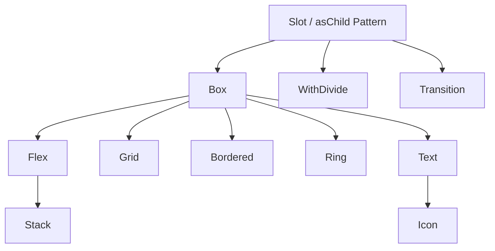

# LifeForge Frontend UI Library Architecture & Usage Guide

Welcome to the **LifeForge UI Library Guide**. This document serves as the single source of truth for frontend development in the LifeForge ecosystem. Anyone writing frontend code for LifeForge must read this guide from cover to cover before writing a single line of code.

---

## 1. Core Philosophy & Architectural Overview

The LifeForge UI library is built on a **zero-runtime CSS-in-JS** architecture powered by **[Vanilla Extract](https://vanilla-extract.style/)** and **[Sprinkles](https://vanilla-extract.style/documentation/packages/sprinkles/)**. This provides total type safety, compile-time optimization, and rich theme integration without the performance overhead of traditional CSS-in-JS solutions.

### Two Strict Rules

> [!IMPORTANT]
> **RULE 1: NO TAILWINDCSS AT ALL**  
> Tailwind classes must never be written in frontend component code. All layout, spacing, typography, and styling must be declared using the custom primitives and high-level components supplied by this library.

> [!IMPORTANT]
> **RULE 2: NO INLINE STYLES FOR CORE LAYOUT & DESIGN**  
> Custom inline `style` objects must be avoided. If a style can be represented through component props or tokens, you **must** use those props. Inline styles are reserved solely for truly dynamic runtime calculations (e.g., coordinates from drag-and-drop events).

### Design Tokens & Dynamic Scaling
The design system defines global tokens under `vars` (compiled to CSS variables) that automatically scale with user personalisation settings:
- **Font Scale (`--custom-font-scale`):** Scales typography and padding/margin dynamically.
- **Border Radius Multiplier (`--custom-border-radius-multiplier`):** Auto-scales corners from sharp to pill-like.
- **Custom Themes (`.theme-[color]` & `.bg-[palette]`):** Sets theme shades for brand colors (`--color-custom-*`) and background palettes (`--color-bg-*` like slate, zinc, neutral, mauve, olive, mist, taupe).

---

## 2. Global Token Systems

All standard layout and typography options are referenced via type-safe tokens exported by the system.

### A. Spacing & Margin/Padding Tokens
Spacing scales are defined under `vars.space` and scale with font size to keep visual rhythm:
- `none`: `'0'`
- `xs`: `calc(var(--spacing) * 1)` (equivalent to `4px` base)
- `sm`: `calc(var(--spacing) * 2)` (`8px` base)
- `md`: `calc(var(--spacing) * 4)` (`16px` base)
- `lg`: `calc(var(--spacing) * 6)` (`24px` base)
- `xl`: `calc(var(--spacing) * 8)` (`32px` base)
- `2xl`: `calc(var(--spacing) * 12)` (`48px` base)
- `3xl`: `calc(var(--spacing) * 16)` (`64px` base)

### B. Border Radius (Rounding) Tokens
Border corners are defined under `vars.radii` and scale with the user's corner multiplier:
- `none`: `'0'`
- `sm`: `var(--radius-sm)`
- `md`: `var(--radius-md)`
- `lg`: `var(--radius-lg)`
- `xl`: `var(--radius-xl)`
- `2xl`: `var(--radius-2xl)`
- `3xl`: `var(--radius-3xl)`
- `full`: `'9999px'`

### C. Typography Scales
Typography values scale with `--custom-font-scale`:

| Size Token | Font Size (`fontSize`) | Line Height (`lineHeight`) |
| :--- | :--- | :--- |
| `xs` | `var(--text-xs)` | `var(--text-xs--line-height)` |
| `sm` | `var(--text-sm)` | `var(--text-sm--line-height)` |
| `base` | `var(--text-base)` | `var(--text-base--line-height)` |
| `lg` | `var(--text-lg)` | `var(--text-lg--line-height)` |
| `xl` | `var(--text-xl)` | `var(--text-xl--line-height)` |
| `2xl` | `var(--text-2xl)` | `var(--text-2xl--line-height)` |
| `3xl` | `var(--text-3xl)` | `var(--text-3xl--line-height)` |
| `4xl` | `var(--text-4xl)` | `var(--text-4xl--line-height)` |
| `5xl` | `var(--text-5xl)` | `1` |
| `6xl` | `var(--text-6xl)` | `1` |
| `7xl` | `var(--text-7xl)` | `1` |
| `8xl` | `var(--text-8xl)` | `1` |
| `9xl` | `var(--text-9xl)` | `1` |

**Font Weights:**
- `normal`: `'400'`
- `medium`: `'500'`
- `semibold`: `'600'`
- `bold`: `'700'`

---

## 3. Style Resolution & The Styling Engine

LifeForge uses a custom styling resolver, `resolveStyles()`, which translates token-based properties and responsive objects into static class names and CSS custom properties at runtime. 

### A. Color Properties & State Resolvers
Colors in LifeForge are resolved through an **arbitrary CSS variable architecture** that handles dynamic user personalization and interactions. The primary color properties are:
- `bg`: Background Color (`--lf-bg`)
- `color`: Text/Foreground Color (`--lf-color`)
- `borderColor`: Border Color (`--lf-border-color`)
- `ringColor`: Focus Ring Color (`--lf-ring-color`)
- `ringOffsetColor`: Offset Ring Color (`--lf-ring-offset-color`)
- `divideColor`: Dividing Line Color (`--lf-divide-color`)

#### Supported Color Keys
1. **Base Palette:** `transparent`, `dangerous` (`#ef4444`), `muted` (mid-gray), `primary` (user-accented), `inherit`, `custom-50` to `custom-900` (accent shades), and `bg-50` to `bg-950` (system background shades).
2. **Tailwind Palette Names:** Colors like `red-500`, `blue-600`, `emerald-400` map directly to tailwind shades.
3. **Color with Opacity:** Zero-runtime opacity can be added using the `colorWithOpacity(token, opacityValue)` utility.

#### Theme & State Specific Variants
Any color prop can receive a static color value or a map of conditions representing interactive states:
```typescript
type ThemeConditionPropName =
  | 'base'               // Default style
  | 'dark'               // Dark mode
  | 'hover'              // Hover state
  | 'darkHover'          // Hover state in dark mode
  | 'hasBgImage'         // Active when page has a background image
  | 'darkHasBgImage'     // Active in dark mode with a background image
  | 'hasBgImageHover'    
  | 'hasBgImageDarkHover'
```

##### Example Usage:
```tsx
<Box 
  bg={{ 
    base: 'bg-50', 
    dark: 'bg-900', 
    hover: 'bg-200', 
    darkHover: 'bg-800' 
  }}
  color={{ base: 'bg-950', dark: 'bg-50' }}
/>
```

### B. Opacity Modifiers (`colorWithOpacity`)
To prevent heavy runtimes, colors can be blended with transparency using CSS `color-mix` through the `colorWithOpacity` helper:
```typescript
import { colorWithOpacity } from '@lifeforge/ui'

// Generates: color-mix(in srgb, var(--color-custom-500) 30%, transparent)
const semiTransparentPrimary = colorWithOpacity('primary', '30%')
```
*Supported Opacity Levels:* `'5%'`, `'10%'`, `'20%'`, `'30%'`, `'40%'`, `'50%'`, `'60%'`, `'70%'`, `'80%'`, `'90%'`.

### C. Responsive Properties & Breakpoints
Layout props support responsive values. Breakpoints are defined as:
- `base`: Mobile first (default, no media query)
- `sm`: `@media (min-width: 640px)`
- `md`: `@media (min-width: 768px)`
- `lg`: `@media (min-width: 1024px)`
- `xl`: `@media (min-width: 1280px)`
- `2xl`: `@media (min-width: 1536px)`

Any responsive property accepts a scalar or a responsive configuration object:
```tsx
// Single width everywhere
<Box width="100%" />

// Responsive width
<Box width={{ base: '100%', md: '50%', lg: '33.33%' }} />
```
*How it works under the hood:* The engine applies `.lf-w` and `.md:lf-w` classes while defining CSS variables (`--lf-w: 100%`, `--lf-w-md: 50%`) inline, keeping output stylesheet sizes extremely small.

---

## 4. The Core Primitives

Primitives are the architectural blocks from which all higher-level views are constructed. They all support `as` and `asChild` composition.



---

### A. Box
The foundational primitive. Renders a `div` by default. It manages spacing, padding, basic layout variables, borders, and rounded corners.

```typescript
interface BoxOwnProps<T extends ElementType = 'div'> {
  as?: T                     // Semantic tag override (e.g. 'section', 'form')
  asChild?: boolean          // Radix Slot composition
  display?: ResponsiveProp<'block' | 'inline' | 'inline-block' | 'none' | 'contents'>
  bg?: ThemeConditionProp<ColorValue>
  shadow?: boolean           // Applies smooth global card shadow (deactivated in dark mode)
  
  // Padding & Margin (Uses SpaceTokens)
  p?: ResponsiveProp<SpaceToken>; px?: ResponsiveProp<SpaceToken>; py?: ResponsiveProp<SpaceToken>
  pt?: ResponsiveProp<SpaceToken>; pb?: ResponsiveProp<SpaceToken>; pl?: ResponsiveProp<SpaceToken>; pr?: ResponsiveProp<SpaceToken>
  m?: ResponsiveProp<SpaceToken>; mx?: ResponsiveProp<SpaceToken>; my?: ResponsiveProp<SpaceToken>
  mt?: ResponsiveProp<SpaceToken>; mb?: ResponsiveProp<SpaceToken>; ml?: ResponsiveProp<SpaceToken>; mr?: ResponsiveProp<SpaceToken>
  
  // Custom Size & Positioning (Responsive CSS strings/numbers)
  width?: ResponsiveProp<string>; height?: ResponsiveProp<string>
  minWidth?: ResponsiveProp<string>; maxWidth?: ResponsiveProp<string>
  minHeight?: ResponsiveProp<string>; maxHeight?: ResponsiveProp<string>
  inset?: ResponsiveProp<string>; top?: ResponsiveProp<string>; bottom?: ResponsiveProp<string>
  left?: ResponsiveProp<string>; right?: ResponsiveProp<string>; zIndex?: ResponsiveProp<string>
  
  // Border Radius (Uses RadiusTokens)
  r?: ResponsiveProp<RadiusToken>     // All corners
  rtl?: ResponsiveProp<RadiusToken>   // Top Left
  rtr?: ResponsiveProp<RadiusToken>   // Top Right
  rbl?: ResponsiveProp<RadiusToken>   // Bottom Left
  rbr?: ResponsiveProp<RadiusToken>   // Bottom Right
}
```

#### Example:
```tsx
<Box 
  as="section"
  bg={{ base: 'bg-50', dark: 'bg-950' }}
  p="lg" 
  r="xl" 
  shadow
  width={{ base: '100%', md: '50rem' }}
>
  Box Content
</Box>
```

---

### B. Flex
Implements a flexbox container. Renders a `flex` layout by default.

```typescript
interface FlexOwnProps extends BoxOwnProps {
  display?: ResponsiveProp<'none' | 'flex' | 'inline-flex'>
  direction?: ResponsiveProp<'row' | 'column' | 'row-reverse' | 'column-reverse'>
  align?: ResponsiveProp<'stretch' | 'center' | 'start' | 'end' | 'baseline'>
  justify?: ResponsiveProp<'start' | 'center' | 'between' | 'around' | 'evenly' | 'end'>
  wrap?: ResponsiveProp<'nowrap' | 'wrap' | 'wrap-reverse'>
  centered?: boolean         // Shortcut to center children perfectly on both axes
  gap?: ResponsiveProp<SpaceToken>
  gapX?: ResponsiveProp<SpaceToken>
  gapY?: ResponsiveProp<SpaceToken>
}
```

#### Example: Responsive Navbar
```tsx
<Flex 
  align="center"
  direction={{ base: 'column', sm: 'row' }} 
  justify="between" 
  p="md"
  gap="sm"
>
  <Text weight="bold">Logo</Text>
  <Flex gap="md">
    <Text>Home</Text>
    <Text>About</Text>
  </Flex>
</Flex>
```

---

### C. Grid
Implements a CSS grid container with specialized normalization utilities.

```typescript
interface GridOwnProps extends BoxOwnProps {
  display?: ResponsiveProp<'none' | 'grid' | 'inline-grid'>
  templateCols?: ResponsiveProp<number | string> // Numbers auto-resolve to 'repeat(N, 1fr)'
  templateRows?: ResponsiveProp<number | string> 
  flow?: ResponsiveProp<'row' | 'column' | 'dense' | 'row dense' | 'column dense'>
  align?: ResponsiveProp<'stretch' | 'center' | 'start' | 'end' | 'baseline'>
  justify?: ResponsiveProp<'start' | 'center' | 'end' | 'between'>
  gap?: ResponsiveProp<SpaceToken>
  gapX?: ResponsiveProp<SpaceToken>
  gapY?: ResponsiveProp<SpaceToken>
}
```

#### Grid Item Options (Passed to children inside any Primitive):
Grid children can utilize custom positioning properties which auto-resolve:
- `gridColumnSpan` (e.g., `2` resolves to `span 2`)
- `gridRowSpan` (e.g., `3` resolves to `span 3`)
- `gridArea`

#### Example: Responsive 3-Column Card Layout
```tsx
<Grid 
  templateCols={{ base: 1, md: 3 }} 
  gap="lg" 
  width="100%"
>
  <Box bg="bg-200" p="md">Card 1</Box>
  <Box bg="bg-200" p="md" gridColumnSpan={{ base: 1, md: 2 }}>
    Card 2 (Spans 2 columns on desktops)
  </Box>
  <Box bg="bg-200" p="md">Card 3</Box>
</Grid>
```

---

### D. Stack
A highly optimized, pre-configured `Flex` container intended for vertical lists. It overrides default flex directions to `column` and sets default width/sizing constraints.

```tsx
// Stack Definition
export function Stack<T extends ElementType = 'div'>(props: FlexProps<T>) {
  return (
    <Flex direction="column" gap="sm" minWidth="0" width="100%" {...props} />
  )
}
```

#### Example:
```tsx
<Stack gap="md">
  <Text size="lg">Form Title</Text>
  <TextInput placeholder="Enter text..." ... />
  <Button>Submit</Button>
</Stack>
```

---

### E. Text
The absolute engine for typography. Renders a `span` by default. It manages clipping, white-space constraints, tracking, and leading.

```typescript
interface TextOwnProps {
  size?: ResponsiveProp<TextSize>            // xs to 9xl
  color?: ThemeConditionProp<ColorValue>
  bg?: ThemeConditionProp<ColorValue>
  weight?: ResponsiveProp<FontWeight>        // normal, medium, semibold, bold
  align?: ResponsiveProp<'left' | 'center' | 'right'>
  decoration?: ResponsiveProp<'underline' | 'line-through' | 'none'>
  transform?: ResponsiveProp<'uppercase' | 'lowercase' | 'capitalize' | 'none'>
  wrap?: ResponsiveProp<'wrap' | 'nowrap' | 'pretty' | 'balance'>
  whiteSpace?: ResponsiveProp<'normal' | 'nowrap' | 'pre' | 'pre-line' | 'pre-wrap'>
  truncate?: boolean                         // Ellipsis clipping on a single line
  lineClamp?: number                         // Standard multi-line truncation
  tracking?: ResponsiveProp<'tighter' | 'tight' | 'normal' | 'wide' | 'wider' | 'widest'>
  leading?: ResponsiveProp<'none' | 'tight' | 'snug' | 'normal' | 'relaxed' | 'loose'>
}
```

#### Example: Headline and Subtitle
```tsx
<Stack gap="xs">
  <Text as="h1" size="3xl" weight="bold" leading="tight" tracking="tight">
    Create Account
  </Text>
  <Text color="muted" size="base">
    Welcome back to LifeForge.
  </Text>
</Stack>
```

---

### F. Icon
Wraps `@iconify/react` into a text-compatible block. Inherits the text color of the parent container by default and maps custom sizes seamlessly.

```typescript
type IconProps = Omit<TextProps, 'size'> & {
  icon: string                               // e.g. "tabler:pencil", "tabler:hammer"
  size?: ResponsiveProp<string | number>     // Defaults to '1.25em'
}
```

#### Example:
```tsx
<Flex align="center" gap="sm">
  <Icon color="primary" icon="tabler:settings" size="1.5em" />
  <Text>Settings</Text>
</Flex>
```

---

### G. Bordered
A primitive specifically made to draw layout borders without writing custom CSS borders.

```typescript
interface BorderedOwnProps extends BoxOwnProps {
  borderColor?: ThemeConditionProp<ColorValue> // Defaults to base: 'bg-300', dark: 'bg-600'
  borderStyle?: 'solid' | 'dashed' | 'dotted' | 'double' | 'none'
  borderSide?: 'all' | 'top' | 'right' | 'bottom' | 'left' | 'x' | 'y'
  borderWidth?: string                         // Defaults to '1px'
}
```

#### Example: Side Border Sidebar
```tsx
<Bordered 
  borderSide="right" 
  borderColor={{ base: 'bg-200', dark: 'bg-800' }}
  borderWidth="2px"
  height="100vh"
  width="16rem"
>
  Sidebar content
</Bordered>
```

---

### H. Ring
Renders an interactive outline (focus rings, custom borders) mapping dynamically to states. Ideal for input focus effects.

```typescript
interface RingProps extends BoxOwnProps {
  ringWidth?: ResponsiveProp<string>          // Defaults to '3px'
  ringColor?: ThemeConditionProp<ColorValue>   // Defaults to 'custom-500'
  ringOffsetWidth?: ResponsiveProp<string>    // Defaults to '0px'
}
```

#### Example:
```tsx
<Ring ringWidth="2px" ringColor="primary" r="md">
  <button>Clickable Element</button>
</Ring>
```

---

### I. WithDivide
An extremely clever composition primitive that adds borders between adjacent sibling nodes. It avoids needing `border-bottom` logic on item render lists.

```typescript
interface WithDivideProps {
  axis?: 'x' | 'y'                           // 'y' divides vertically (adds borderTop)
                                             // 'x' divides horizontally (adds borderLeft)
  color?: ThemeConditionProp<ColorValue>     // Defaults to base: bg-200, dark: bg-700
  children?: ReactNode
}
```

#### Example: List Group Dividers
```tsx
<WithDivide axis="y" color={{ base: 'bg-300', dark: 'bg-800' }}>
  <Stack gap="none">
    <Box p="md">Item 1</Box>
    <Box p="md">Item 2</Box>
    <Box p="md">Item 3</Box>
  </Stack>
</WithDivide>
```

---

### J. Transition
Applies CSS transitions to a wrapped component utilizing the `asChild` composition pattern. No wrapper elements are injected into the DOM.

```typescript
interface TransitionProps {
  duration?: number | string                 // e.g. 200, '300ms', '0.2s'. Defaults to '100ms'
  easing?: 'linear' | 'ease' | 'ease-in' | 'ease-out' | 'ease-in-out' | (string & {})
  delay?: number | string
  property?: PropertyValue | TransitionEntry | Array<PropertyValue | TransitionEntry>
}
```

#### Example: Smooth Color Change on Hover
```tsx
<Transition duration="150ms" property={['background-color', 'color']}>
  <Box 
    bg={{ base: 'bg-100', hover: 'primary' }}
    color={{ base: 'bg-950', hover: 'bg-50' }}
    p="md"
    r="md"
  >
    Hover Me
  </Box>
</Transition>
```

---

## 5. Composition & Chaining Rules

Primitives are designed to be composed together using the `asChild` pattern. This merges the class names, styling resolvers, and custom variables of multiple layers onto a single DOM node.

### A. The `asChild` composition
When `asChild` is set, the primitive passes all of its compiled props and styles directly to its only child.

```tsx
// ❌ INCORRECT: Injects redundant DOM elements, making styling hard to trace
<Transition>
  <Box bg="primary" p="md">
    <Text as="h3" size="lg">Headline</Text>
  </Box>
</Transition>

//     CORRECT: Flattens the hierarchy into a single clean DOM node
<Transition duration="200ms" property="all">
  <Box 
    asChild 
    bg={{ base: 'bg-100', hover: 'bg-200' }} 
    p="md" 
    r="md"
  >
    <Text as="h3" size="lg">Headline</Text>
  </Box>
</Transition>
```

### B. Standard Layout Chain
When constructing standard layout components, follow this order:
1. **Structural Grid/Stack:** Define overall templates and spacing bounds.
2. **Interactive/Animated Transition:** Handle states and transition variables.
3. **Card/Bordered Wrapper:** Render the visible card backgrounds, shadows, and corners.
4. **Content Flex/Stack:** Lay out content alignment and gaps.

```tsx
<Grid templateCols={{ base: 1, md: 3 }} gap="lg">
  {items.map(item => (
    <Transition key={item.id} duration="150ms" property="all">
      <Bordered 
        asChild
        bg={{ base: 'bg-100', hover: 'bg-200' }}
        p="lg"
        r="lg"
      >
        <Stack gap="md">
          <Text size="xl" weight="bold">{item.title}</Text>
          <Text color="muted">{item.desc}</Text>
        </Stack>
      </Bordered>
    </Transition>
  ))}
</Grid>
```

---

## 6. High-Level Forms & Interactive Components

### A. Button
The core button component manages accessibility, internationalization translations, dynamic loading spinners, and personalization background-contrast matching.

```typescript
type ButtonProps = {
  variant?: 'primary' | 'secondary' | 'tertiary' | 'plain'
  dangerous?: boolean                        // Destructive actions (red style)
  icon?: string                              // Iconify name, e.g. 'tabler:plus'
  iconPosition?: 'start' | 'end'
  loading?: boolean                          // When true, disables clicks and renders a spinner
  disabled?: boolean
  namespace?: string                         // i18n translation prefix (defaults to 'common.buttons')
  children?: ReactNode
}
```

#### Notable Engineering Features:
1. **Dynamic Contrast Matching:** In `useButtonStyleProps`, when `variant="primary"` is set, the button fetches the user's active theme color (`derivedThemeColor`) and runs `getMostReadableColor()` to compute a text color with optimal contrast.
2. **Smart i18n Translation:** If the children is a string, it automatically attempts to search for translations across various namespaces (e.g., `buttons.cancel`, `common.buttons:cancel`).
3. **Loading Spinners:** Renders the pre-animated `svg-spinners:ring-resize` icon automatically.

#### Example:
```tsx
<Button 
  variant="primary"
  icon="tabler:send"
  loading={isSubmitting}
  onClick={onSubmit}
>
  sendFeedback
</Button>
```

---

### B. Form Input Infrastructure (`TextInput`)
All inputs share a unified visual style by extending components from the `inputs/shared` module:
- `InputWrapper`: Creates the surrounding classic/plain background field, error display, and click handlers.
- `InputLabel`: Coordinates labels, required asterisks, and floating positions.
- `InputIcon`: Renders helper icons aligned within field paddings.

#### Example: Password Input with Visibility Toggles
```tsx
<TextInput 
  isPassword
  label="Password"
  placeholder="••••••••"
  value={password}
  icon="tabler:lock"
  errorMsg={errors.password}
  onChange={setPassword}
/>
```

---

## 7. Real-world Codebase Walkthrough

Here is a complete, real-world view page (`UserCreationPage.tsx`) utilizing the UI library. Observe how grid structures, text responsiveness, and inputs are combined without writing standard CSS or inline styles:

```tsx
import { useMutation } from '@tanstack/react-query'
import { useState } from 'react'
import { useTranslation } from 'react-i18next'
import { toast } from 'react-toastify'

import { Button, Flex, Icon, Stack, Text, TextInput } from '@lifeforge/ui'
import forgeAPI from '@/forgeAPI'

function UserCreationPage() {
  const { t } = useTranslation('common.auth')

  const [formData, setFormData] = useState({
    email: '',
    username: '',
    name: '',
    password: '',
    confirmPassword: ''
  })

  const [errors, setErrors] = useState<Record<string, string>>({})

  const createUserMutation = useMutation(
    forgeAPI.user.auth.createFirstUser.mutationOptions({
      onSuccess: () => {
        toast.success(t('messages.userCreated'))
        window.location.reload()
      },
      onError: (error: Error) => {
        toast.error(error.message)
      }
    })
  )

  const updateField = (field: string) => (value: string) => {
    setFormData(prev => ({ ...prev, [field]: value }))
    setErrors(prev => ({ ...prev, [field]: '' }))
  }

  const validateForm = () => {
    const newErrors: Record<string, string> = {}

    if (!formData.email.trim()) {
      newErrors.email = t('validation.emailRequired')
    } else if (!/^[^\s@]+@[^\s@]+\.[^\s@]+$/.test(formData.email)) {
      newErrors.email = t('validation.emailInvalid')
    }

    if (!formData.username.trim()) {
      newErrors.username = t('validation.usernameRequired')
    }

    if (!formData.password) {
      newErrors.password = t('validation.passwordRequired')
    } else if (formData.password.length < 8) {
      newErrors.password = t('validation.passwordTooShort')
    }

    if (formData.password !== formData.confirmPassword) {
      newErrors.confirmPassword = t('validation.passwordMismatch')
    }

    setErrors(newErrors)
    return Object.keys(newErrors).length === 0
  }

  const handleSubmit = (e: React.FormEvent) => {
    e.preventDefault()
    if (!validateForm()) return

    createUserMutation.mutateAsync({
      email: formData.email,
      username: formData.username,
      name: formData.name,
      password: formData.password
    })
  }

  return (
    // 1. Center layout with responsive paddings and full width bounds
    <Flex centered direction="column" px="xl" width="100%">
      
      // 2. Main title using asChild to combine structural Box with semantic Heading
      <Flex asChild centered gap="sm" mb="xl">
        <Text as="h1" size="3xl" weight="semibold" whiteSpace="nowrap">
          <Icon color="primary" icon="tabler:hammer" />
          <div>
            LifeForge
            <Text color="primary" size="4xl">.</Text>
          </div>
        </Text>
      </Flex>

      // 3. Responsive typography heading (scales automatically on tablet/desktop)
      <Text
        align="center"
        as="h2"
        size={{ base: '4xl', sm: '5xl' }}
        tracking="wide"
        weight="semibold"
      >
        {t('welcome.header')}
      </Text>

      // 4. Subtitle with themed color and responsive margins
      <Text
        align="center"
        as="p"
        color="muted"
        mt={{ base: 'sm', sm: 'md' }}
        size={{ base: 'base', sm: 'xl' }}
      >
        {t('welcome.desc')}
      </Text>

      // 5. Central form container bounded by max width
      <Stack maxWidth="40rem" mt="2xl" width="100%">
        <TextInput
          errorMsg={errors.email}
          icon="tabler:mail"
          inputMode="email"
          label={t('inputs.email.label')}
          placeholder={t('inputs.email.placeholder')}
          value={formData.email}
          onChange={updateField('email')}
        />
        
        <TextInput
          errorMsg={errors.username}
          icon="tabler:at"
          label={t('inputs.username.label')}
          placeholder={t('inputs.username.placeholder')}
          value={formData.username}
          onChange={updateField('username')}
        />

        <TextInput
          isPassword
          errorMsg={errors.password}
          icon="tabler:lock"
          label={t('inputs.password.label')}
          placeholder={t('inputs.password.placeholder')}
          value={formData.password}
          onChange={updateField('password')}
        />

        <TextInput
          isPassword
          errorMsg={errors.confirmPassword}
          icon="tabler:lock-check"
          label={t('inputs.confirmPassword.label')}
          placeholder={t('inputs.confirmPassword.placeholder')}
          value={formData.confirmPassword}
          onChange={updateField('confirmPassword')}
        />

        // 6. Action Button with custom icons, alignment, and loading states
        <Button
          icon="tabler:arrow-right"
          iconPosition="end"
          loading={createUserMutation.isPending}
          mt="md"
          onClick={handleSubmit}
        >
          {t('buttons.proceed')}
        </Button>
      </Stack>
    </Flex>
  )
}

export default UserCreationPage
```

---

## 8. Developer Quick-Reference Checklist

Before submitting a pull request, verify that you have adhered to all core design patterns:

- [ ] **No Tailwind classes:** There is not a single `className="flex..."` or similar Tailwind class in your components.
- [ ] **No arbitrary inline styles:** Inline `style` is only used for properties computed at runtime (e.g. coordinates or scales). Standard layouts use `p`, `m`, `width`, `height`, etc.
- [ ] **Strict font-sizing rules:** Prohibited `text-xs` is never used. Default size is `text-base` (omit size prop), and titles use sizes `>= text-lg`.
- [ ] **Correct loaders:** Form/button loading states use the pre-animated `svg-spinners:ring-resize` icon and **never** use custom `animate-spin` utilities.
- [ ] **Type safety:** Typescript `any` is never used. All prop overrides and custom handlers are explicitly typed.
- [ ] **Datetime manipulation:** Standard JavaScript `Date` is never used. `day.js` is imported for any date calculations.
- [ ] **Component organization:** Components are strictly separated into individual files under their respective `components/` folders instead of being grouped together.
- [ ] **Conventional functions:** All React components use standard function declarations (`export function Component()`) and avoid arrow functions.
